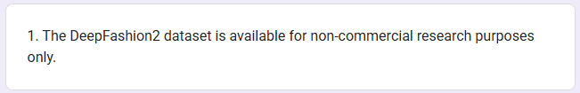
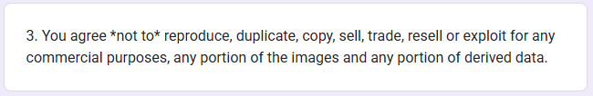

# SlowFashionProject
Cloth Classification for the company slow fashion. All data and model trained on it belong to slow fashion and cannot be published.

# Dataset to explore

For quick testing  
[kaggle Fashion MNIST](https://www.kaggle.com/datasets/zalando-research/fashionmnist)  
Bigger dataset (7gigs)  
[kaggle clothing dataset](https://www.kaggle.com/datasets/agrigorev/clothing-dataset-full)  
Biggest dataset (250gigs)  
[DeepFashion2](https://drive.google.com/drive/folders/125F48fsMBz2EF0Cpqk6aaHet5VH399Ok), [Form](https://docs.google.com/forms/d/e/1FAIpQLSeIoGaFfCQILrtIZPykkr8q_h9qQ5BoTYbjvf95aXbid0v2Bw/viewform) to get the code

⚠️ DeepFashion is not available for commercial use, [source](https://docs.google.com/forms/d/e/1FAIpQLSeIoGaFfCQILrtIZPykkr8q_h9qQ5BoTYbjvf95aXbid0v2Bw/viewform), using it for SlowFashion production is copyright infrigement and future audit WILL see it.

# About the papers
Deep Learning for Clothing Style Recognition Using YOLOv5
This paper do Clothing Style Recognition with YOLOv5 and R-CNN, the metric used are average precison, mean average precison, recall, F1-score, model
size, and frame per second. They Evaluate different architecture and want to be deployable on mobile device.

